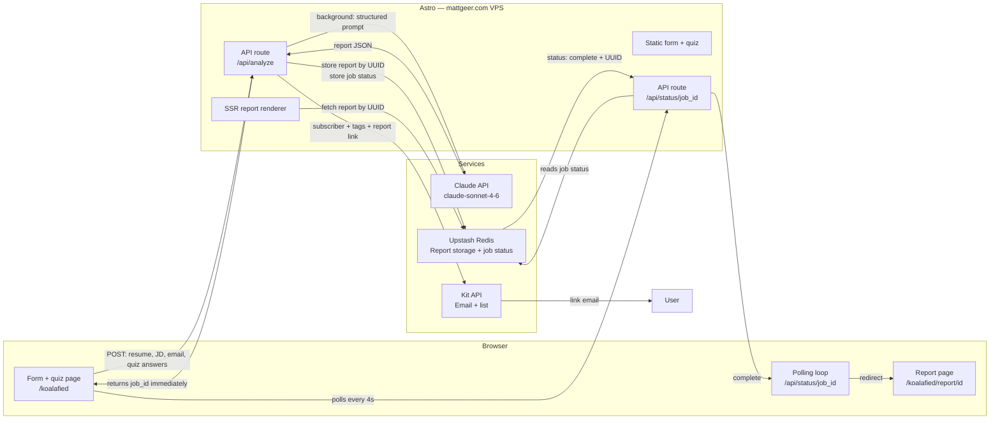
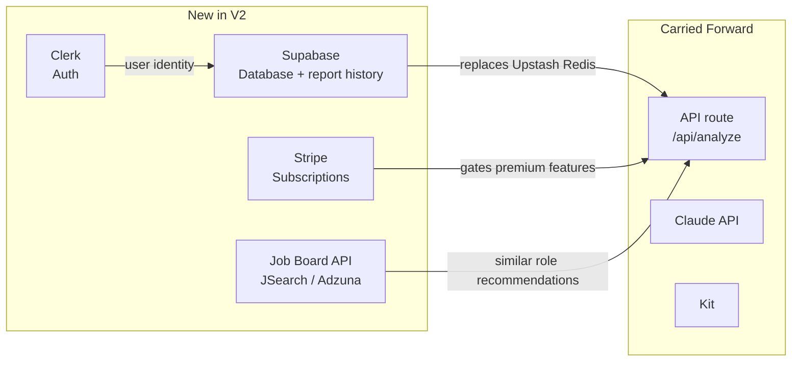

# Koalafied — Architecture & Stack

## User Flow

```mermaid
flowchart TD
    A[mattgeer.com/koalafied\nForm page] --> B[Paste resume + job description\n+ enter email]
    B --> C[Quiz — 5 questions\nFramed as personalization step\nJob stage · Challenge · PM level\nAI level · AI goals]
    C --> D[Submit — Claude starts here\nafter quiz answers are collected]
    D --> E[/api/analyze\nReturns job_id immediately]
    E --> F[Processing screen\nPolls /api/status/job_id every 4s\nStage-based status messages]
    F --> G[Background: Claude API\nGenerate full 10-section report]
    G --> H[Background: Upstash Redis\nStore report JSON by UUID\n30-day TTL]
    H --> I[Background: Kit API\nCreate subscriber\nTag by quiz answers\nSend report link email]
    I --> J[Polling catches complete status]
    J --> K[Browser redirects to report page\nKit email sent as backup]
    K --> L[mattgeer.com/koalafied/report/id\nFull report — all 10 sections]
    L --> M[Download as PDF\nbrowser print]
```

---

## System Architecture — MVP



---

## System Architecture — V2

What gets added when accounts and paid tier come in:



**Key shifts at V2:**
- Upstash Redis (temporary, TTL) → Supabase Postgres (permanent, queryable, user-linked)
- Anonymous reports → authenticated users with full report history
- Free only → Stripe subscription gate on premium features
- Static affiliate links → live job board recommendations

---

## Stack Rationale + Costs

### Astro
**Why:** Already the stack on mattgeer.com. SSR mode handles the dynamic report page and API routes cleanly. No new framework to learn, deploys to the existing VPS.
**Trade-off:** Not a full SPA — less ecosystem for complex UI interactions. Fine for Koalafied at MVP scope.
**Cost:** $0 — runs on existing Hostinger VPS.

### Upstash Redis
**Why:** Key-value store with native TTL support — perfect for 30-day report expiry and temporary job status tracking. Zero database schema to design. Free tier easily covers MVP volume. Works from any backend via REST API — compatible with the VPS deployment (unlike Vercel KV, which requires Vercel infrastructure).
**Trade-off:** Not queryable. Can't aggregate data (e.g., "most common skill gaps across all reports") without migrating to a real database.
**Migration plan:** Move to Supabase when user accounts are added in V2. Design report JSON schema now with that migration in mind.
**Cost:** Free tier — 256MB storage, 500k requests/month.

### Claude API (claude-sonnet-4-6)
**Why:** Best-in-class for structured, nuanced long-form text. Matt already knows the API. Prompt quality from day one will be higher than starting from scratch with another model. Legitimate "built with Claude API" resume and portfolio claim.
**Prompt caching:** Enabled from launch — caches the system prompt, reducing per-report input costs ~60–70% at scale.
**Cost (with caching):** ~$0.02–0.04 per report at MVP volume.
- 100 reports/month → ~$2–4/month
- 1,000 reports/month → ~$20–40/month
- Essentially free until meaningful scale.

### Kit
**Why:** Already Matt's email platform. Subscriber tagging by quiz answers is native. Zero new infrastructure. Liquid conditionals enable personalized sequences based on tags.
**Trade-off:** Marketing email tool, not transactional. For MVP volume, delivery reliability is fine. Revisit if report delivery needs guaranteed sub-minute delivery at scale.
**Cost:** Free up to 10,000 subscribers.

### API Routes (Astro SSR on VPS)
**Why:** The orchestration logic (Claude → Upstash → Kit) runs as Astro API routes on the existing VPS. Background job pattern: `/api/analyze` returns a job_id immediately, heavy work runs async, `/api/status/[job_id]` is polled by the client.
**Trade-off:** Hosted on the VPS alongside the site — if the VPS goes down, so does the API. Vercel or Netlify functions are more resilient. Fine for MVP; worth revisiting at scale.
**Cost:** $0 — VPS already paid for.

---

## Architectural Pre-Decisions

MVP choices made with V2 in mind to avoid rewrites:

1. **Store reports as structured JSON, not raw HTML.** The report page renders JSON → HTML. This makes reports portable, queryable, and migratable to Supabase later.

2. **Analysis only — raw resume and JD are never stored.** Claude processes the inputs and returns the analysis. Raw inputs stay in memory during the API call only. Cleaner privacy surface area; sufficient for full report rendering.

3. **Tag Kit subscribers by quiz answers from day one.** These tags become the segmentation foundation for nurture sequences and will map directly to user profile fields in V2 accounts.

4. **Use UUIDs for report IDs.** Harder to enumerate than sequential IDs. Works identically whether reports live in Upstash or a database.

5. **Background job pattern for Claude API calls.** `/api/analyze` returns a job_id immediately. Client polls `/api/status/[job_id]`. Prevents timeout failures on 30–60 second Claude responses. Job status stored in Upstash with a 5-minute TTL.

6. **Keep the Claude API call in an isolated service function.** Don't entangle it with Astro internals. Easier to move to a different backend, test in isolation, or swap models later.

7. **Build PM skill taxonomy before writing the prompt.** Pull 20–30 real PM JDs, extract common requirements, assign weights. The taxonomy is required for the formula-computed scoring system — it must exist before the Claude prompt can be written.

8. **Design the report JSON schema before writing the prompt.** The schema determines what Claude needs to return. Getting this right early avoids prompt rewrites when the report page is built.

9. **Affiliate URLs resolved at render time, not stored in schema.** Report stores `resource_key` only. A local `resources.js` lookup file maps keys → affiliate URLs. Updating an affiliate link updates all active reports immediately.

Last updated: 2026-06-05
